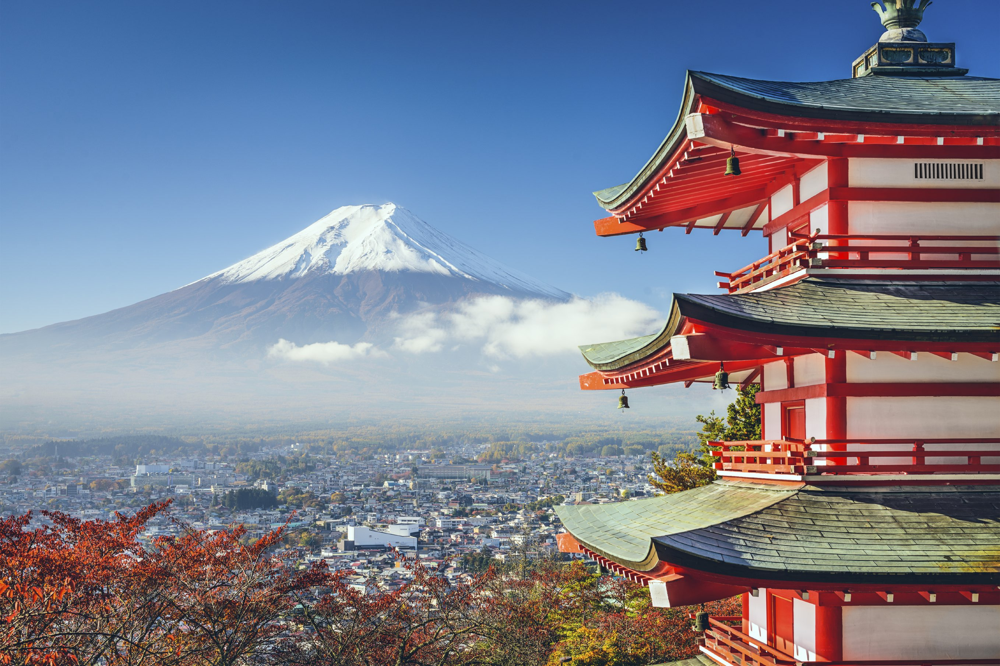
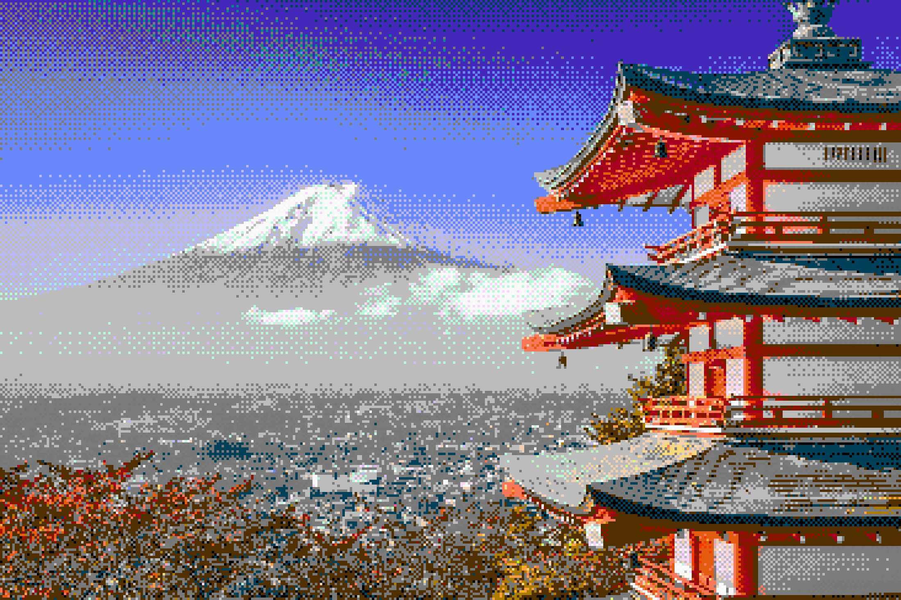
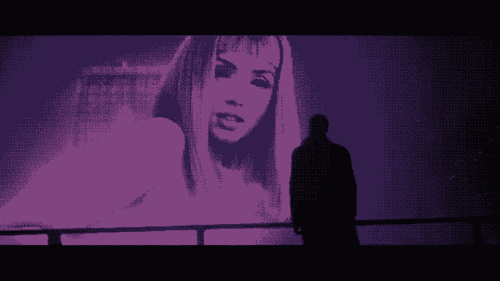
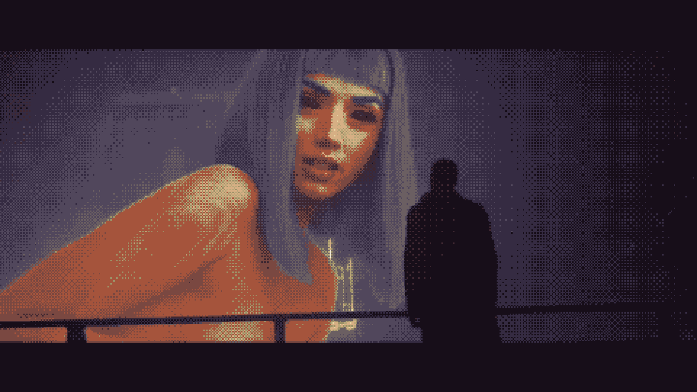

# Pixel Art Generator

Browser tool that converts images, GIFs, and videos to pixel art with live preview, palettes, dithering, and private client-side processing.

## Webpage:
Check it out [here](https://asbou45115.github.io/pixel-art-generator/)

## Run locally

```bash
py -m http.server 8080
```

Then open http://localhost:8080

## Examples

### Still image - Mount Fuji

| Before | After |
| --- | --- |
|  |  |

- [`mt_fuji_before.png`](assets/examples/mt_fuji_before.png) · [`mt_fuji_after.png`](assets/examples/mt_fuji_after.png)

### Animated GIFs





- [`gif_example.gif`](assets/examples/gif_example.gif) · [`gif_example2.gif`](assets/examples/gif_example2.gif)

Upload any of these from the landing page, or use **Upload file** in the editor header after opening another image. Use them to try the frame strip, play preview, palette/dither controls, and GIF/MP4 export.

## Features

- Upload PNG, JPG, GIF, WEBP, MP4, or WebM — no file size limit; still images process at full resolution (client-side only)
- Animated GIF and video support with a frame strip to preview individual frames
- Play animation preview in the browser (pixelated frames prefetched ahead for smooth playback)
- Dark mode by default with light/dark toggle in the header
- Header export controls: upload file, format, output size, and download (defaults to original size)
- Export animations as GIF or MP4 with progress bar and cancel support
- Live pixel size, brightness, contrast, saturation controls
- Built-in palettes (Pico-8, Lost Century, Game Boy, NES, and more)
- Auto palette extracted from the source (shared across animation frames on export)
- Floyd-Steinberg and ordered dithering
- Optional black outlines via edge detection (Sobel or Canny), with threshold and line-thickness sliders
- Lospec palette import
- Export still images as PNG, JPEG, or WebP at multiple sizes

### Edge detection (outlines)

The **Outlines** panel adds retro-style black line art on top of the pixelated image. Outlines are drawn after palette quantization and dithering so they stay solid black.

| Control | Description |
| --- | --- |
| **Edge detection** | `None`, `Sobel`, or `Canny` |
| **Edge threshold** | 1–255 (default 50). Lower = more lines; higher = only the strongest edges |
| **Line thickness** | 1–5 px (default 1). Thickens detected edges before compositing |

- **Sobel** — fast gradient-based edges; good starting point for a crisp pixel-art look
- **Canny** — blur, non-max suppression, and hysteresis; smoother, less noisy outlines at similar thresholds

Edges are detected on the downscaled image (before quantization) for cleaner lines, then stamped onto the final output. Works on still images and every frame of GIF/video exports.

**Suggested starting point:** enable a palette + ordered dither, then try Sobel with threshold ~30–60 and thickness 1.

## Limits

The app does not artificially cap frame count, video duration, or image dimensions. Practical limits come from your browser and device:

- Animated GIF decoding requires `ImageDecoder` (Chrome, Edge, Firefox)
- Full-frame video capture requires `requestVideoFrameCallback` (Chrome, Edge, Firefox, Safari 15.4+)
- MP4 export uses WebCodecs when available, otherwise falls back to the browser's native recorder
- GIFs and videos open quickly; frames are decoded on demand instead of buffered in memory
- Videos index in the background (frame timing only) while you edit; playback is available once indexing finishes
- Export processes one frame at a time (capture → pixelate → encode) so peak memory stays low
- Background video indexing runs at playback speed; export of long videos also replays the source at least once
- Very large single frames (high-resolution stills) still use significant RAM during processing

## Project structure

```
index.html
assets/
  examples/
    gif_example.gif       
    gif_example2.gif
    mt_fuji_before.png    Example source image
    mt_fuji_after.png     Example pixel art output
  css/styles.css
  js/
    main.js          Page bootstrap
    layout.js        Compact header
    editor.js        Editor UI
    pixelate.js      Image processing
    palettes.js      Palette data
    upload.js        Upload zone
    media-source.js  GIF/video frame loading
    media-export.js  GIF/MP4 export
    progress.js      Cancellable task overlay with progress
    theme.js         Dark/light theme toggle
    range-input.js   Filled range slider styling
    gifenc.js        GIF encoder (vendored)
    mp4-muxer.js     MP4 muxer (vendored)
```
